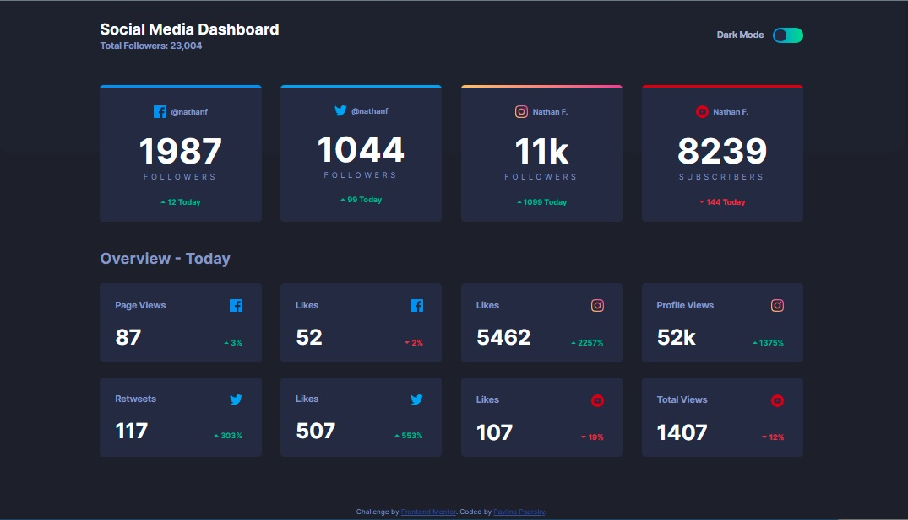
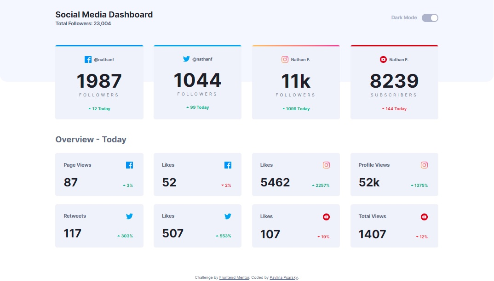
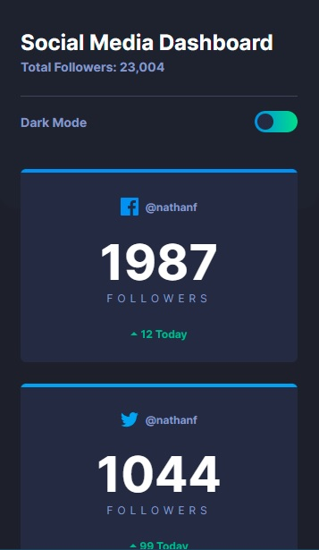
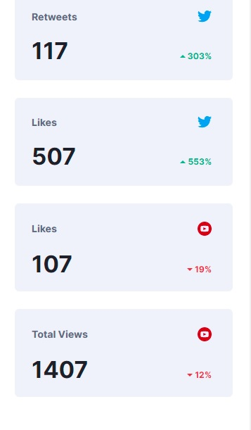

# Frontend Mentor - Social media dashboard with theme switcher solution

This is a solution to the [Social media dashboard with theme switcher challenge on Frontend Mentor](https://www.frontendmentor.io/challenges/social-media-dashboard-with-theme-switcher-6oY8ozp_H). Frontend Mentor challenges help you improve your coding skills by building realistic projects. 

## Table of contents

- [Overview](#overview)
  - [The challenge](#the-challenge)
  - [Screenshot](#screenshot)
  - [Links](#links)
- [My process](#my-process)
  - [Built with](#built-with)
  - [What I learned](#what-i-learned)
  - [Continued development](#continued-development)
  - [Useful resources](#useful-resources)
- [Author](#author)
- [Acknowledgments](#acknowledgments)

## Overview

### The challenge

Users should be able to:

- View the optimal layout for the site depending on their device's screen size
- See hover states for all interactive elements on the page
- Toggle color theme to their preference

### Screenshot

| Desktop layout |
|:--:|
 

| Mobile layout |
|:--:|
  

### Links

- Solution URL: https://github.com/PavlinaPs/react-social-media-dashboard
- Live Site URL: https://pavlinaps.github.io/react-social-media-dashboard/

## My process

### Built with

- Semantic HTML5 markup
- CSS custom properties
- Flexbox
- CSS Grid
- Mobile-first workflow
- [React](https://reactjs.org/) - JS library
- BEM

### What I learned

This is the best challenge yet! My 3rd challenge using React.

- ##### Sass
First I thought there isn't much for React to do, so I coded the styles in Sass to figure out, how it works together. I think it went well.

- ##### Theme toggle
There was a little challenge for me on hover. Per design, on hover above the toggle switch the toggle label changes color. I couldn't find a compound selector to select the label, when it was written above the switch in JSX. Because ~ or + select sibling elements AFTER the switch. I solved this by changing the order of elements in JSX, so I could use the sibling selector and put it back in correct order with css flex order. I hope this description makes sense.

```jsx
<div className="Heading__toggle--container">
    <div 
        className="Heading__toggle"
        onClick={handleChangeTheme}
        aria-label="theme toggle"
    >
      ...
    </div>
    <div className="Heading__toggle--label">Dark Mode</div>
</div>
```

```css
.Heading__toggle--label {
    order: 0;
}

.Heading__toggle {
    order: 1;
    ...
}

.Heading__toggle:hover~.Heading__toggle--label {
    color: hsl(0, 0%, 100%);
} 
```

- ##### JSON, my first API
I wrote the data in two JSON files. I included the icons, colors and alt descriptions as well:

```json
{
    "dataAll": [
        {
            "id": "1",
            "border": "hsl(208, 92%, 53%)",
            "icon": "/icon-facebook.svg",
            "social": "Facebook",
            "username":"@nathanf",
            "followers":"1987",
            "description": "followers",
            "today":"12"
        },
        ...
    ]
}
```

- ##### Dynamic rendering
Since I had the JSONs on hand, I could easily render icons, number formats and daily changes dynamically. I love it! I think I got the most of it possible. 
```jsx

```
```jsx
<p className="Today__block--followers">
    {Number(followers) < 9999 ? followers : Math.floor(Number(followers) / 1000) + "k"}
</p>
```
```jsx
<div className="Today__block--percent-container">
    = 0 ? arrowUp : arrowDown}
        alt={Number(percent) >= 0 ? "green arrow up" : "red arrow down"}
    />
    <p 
        className="Today__block--percent"
        style={Number(percent) >= 0 ? {color: "hsl(163, 72%, 41%)"} : {color: "hsl(356, 69%, 56%)"}}
    >{Math.abs(percent)}%</p>
</div>
```
- ##### LocalStorage
I used the LocalStorage for the first time for the browser to remember last theme setting. Yay!

### Continued development

I want to improve in React.js.


### Useful resources

- [React Component with JSON Image path](https://stackoverflow.com/questions/50115140/react-component-with-json-image-path) 
- [React js Dark Mode With localStorage](https://www.youtube.com/watch?v=5zeuW802NLg)

## Author

- GitHub - [PavlinaPs](https://github.com/PavlinaPs)
- Frontend Mentor - [@PavlinaPs](https://www.frontendmentor.io/profile/PavlinaPs)

## Acknowledgments

It is great that I can solve Frontend Mentor's challenges. They are all very useful for me. Every single one. Thank you!
